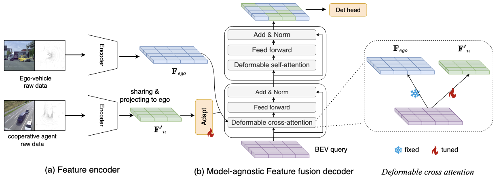

# Towards Model-Agnostic Cooperative Perception (IJCNN2025)

Abstract: We introduce IMCP, a robust Intermediate Model-Agnostic Cooperative Perception framework.
IMCP enables universal agent fusion without the need for joint training or model sharing. 
Each agent undergoes independent initial training, followed by a cooperative fine-tuning stage where the feature encoder of each agent remains frozen.
To effectively fuse features from diverse domains, we incorporate parameter-efficient hierarchical feature adaptation layers that map features into a common representation space.
Deformable attention is employed to selectively aggregate multiple Bird's-Eye View (BEV) features of varying sizes.

<div align="left">
	
</div>

# Installation
This repository is based on [OpendCood.](https://opencood.readthedocs.io/en/latest/md_files/installation.html), please also refer the documents to install.
### prepare environment
```bash
# you may change the version based on your system
conda create --name IMCP python=3.8
conda activate IMCP
conda install pytorch==2.0.0 torchvision==0.15.1 cudatoolkit=11.8 -c pytorch -c conda-forge
```

### install IMCP

```bash
git clone https://github.com/JesseWong333/metacoop.git
cd LRCP
pip install -r requirements.txt
python setup.py develop

python opencood/utils/setup.py build_ext --inplace 
python opencood/pcdet_utils/setup.py build_ext --inplace 
```
### install spconv 1.2.1
please refer to https://github.com/traveller59/spconv


### Compiling deformable attention operators
```bash
cd ./opencood/utils/ms_deform_attn_ops
sh ./make.sh
# unit test (should see all checking is True)
python test.py
```

# Data Preparation

please refer to [OpenCOOD](https://github.com/DerrickXuNu/OpenCOOD) for data preparation.

#### Training

## single agent training
``` bash
# step1: single agent training, please specify your data path in the yaml file
python opencood/tools/train.py --hypes_yaml ./opencood/hypes_yaml/v2v4real/pointpillar_deformable_attn_coop_single.yaml

After getting the ego agent model and the cooperative model, fill in the model path into the cooperative fine-tuning config file.

## cooperative fine-tuning
# stage2: cooperative fine-tuning, please specify your data path and the step1 model in the yaml file
python opencood/tools/train_w_delay.py --hypes_yaml ./opencood/hypes_yaml/v2v4real/pointpillar_deformable_attn_coop_point_pillar_extend_point_pillar.yaml
```

#### Evaluation
``` bash
python opencood/tools/inference.py  --model_dir ./opencood/logs/your_log_path, --fusion_method intermediate
```


## Acknowlege

This project is impossible without the code of [OpenCOOD](https://github.com/DerrickXuNu/OpenCOOD), [CoAlign](https://github.com/yifanlu0227/CoAlign), [Deformable DETR](https://github.com/fundamentalvision/Deformable-DETR).

## Citation
```bibtex
@INPROCEEDINGS{wang2025modelagnostic,
  title={Towards Model-Agnostic Cooperative Perception}
  author={Wang, Junjie and Nordstr{\"o}m, Tomas},
  booktitle={International Joint Conference on Neural Networks (IJCNN)}, 
  year={2025},
  organization={IEEE}
}
```

